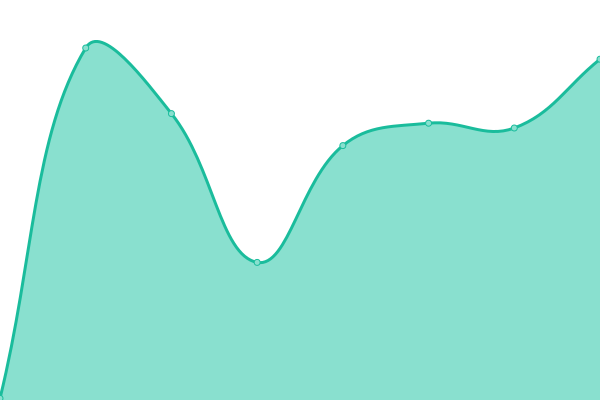
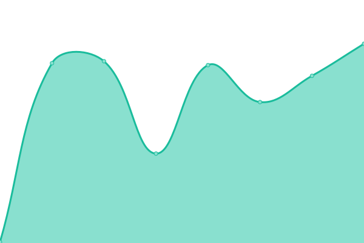

# [📈 Live Status](https://demo.upptime.js.org): <!--live status--> **🟨 Degraded performance**

This repository contains the open-source uptime monitor and status page for [zv8001](https://demo.upptime.js.org), powered by [Upptime](https://github.com/upptime/upptime).

With [Upptime](https://upptime.js.org), you can get your own unlimited and free uptime monitor and status page, powered entirely by a GitHub repository. We use [Issues](https://github.com/zv8001/EEI-Stats/issues) as incident reports, [Actions](https://github.com/zv8001/EEI-Stats/actions) as uptime monitors, and [Pages](https://demo.upptime.js.org) for the status page.

<!--start: status pages-->
<!-- This summary is generated by Upptime (https://github.com/upptime/upptime) -->
<!-- Do not edit this manually, your changes will be overwritten -->
<!-- prettier-ignore -->
| URL | Status | History | Response Time | Uptime |
| --- | ------ | ------- | ------------- | ------ |
|  [ZV800.com](https://www.zv800.com//) | 🟩 Up | [zv-800-com.yml](https://github.com/zv8001/EEI-Stats/commits/HEAD/history/zv-800-com.yml) | 

 166ms
     
 | 

<a href="https://zv8001.github.io/EEI-Stats/history/zv-800-com">100.00%</a>
    

|  [EEI API](https://eei-api-533b.netlify.app/) | 🟩 Up | [eei-api.yml](https://github.com/zv8001/EEI-Stats/commits/HEAD/history/eei-api.yml) | 

 148ms
     
 | 

<a href="https://zv8001.github.io/EEI-Stats/history/eei-api">100.00%</a>
    

|  [Main Roblox](https://www.roblox.com/) | 🟩 Up | [main-roblox.yml](https://github.com/zv8001/EEI-Stats/commits/HEAD/history/main-roblox.yml) | 

 207ms
     
 | 

<a href="https://zv8001.github.io/EEI-Stats/history/main-roblox">100.00%</a>
    

|  [Roblox Devform](https://devforum.roblox.com/) | 🟩 Up | [roblox-devform.yml](https://github.com/zv8001/EEI-Stats/commits/HEAD/history/roblox-devform.yml) | 

 590ms
     
 | 

<a href="https://zv8001.github.io/EEI-Stats/history/roblox-devform">100.00%</a>
    

|  [Roblox Devhub](https://developer.roblox.com) | 🟩 Up | [roblox-devhub.yml](https://github.com/zv8001/EEI-Stats/commits/HEAD/history/roblox-devhub.yml) | 

 228ms
     
 | 

<a href="https://zv8001.github.io/EEI-Stats/history/roblox-devhub">97.24%</a>
    

|  [Avatar API Endpoint](https://avatar.roblox.com/v1/avatar-rules) | 🟨 Degraded | [avatar-api-endpoint.yml](https://github.com/zv8001/EEI-Stats/commits/HEAD/history/avatar-api-endpoint.yml) | 

 1140ms
     
 | 

<a href="https://zv8001.github.io/EEI-Stats/history/avatar-api-endpoint">99.56%</a>
    

|  [Badges API Endpoint](https://badges.roblox.com/v1/badges/2124548403) | 🟩 Up | [badges-api-endpoint.yml](https://github.com/zv8001/EEI-Stats/commits/HEAD/history/badges-api-endpoint.yml) | 

 120ms
     
 | 

<a href="https://zv8001.github.io/EEI-Stats/history/badges-api-endpoint">100.00%</a>
    

|  [Catalog API Endpoint](https://catalog.roblox.com/v1/bundles/details?bundleIds=192) | 🟩 Up | [catalog-api-endpoint.yml](https://github.com/zv8001/EEI-Stats/commits/HEAD/history/catalog-api-endpoint.yml) | 

 155ms
     
 | 

<a href="https://zv8001.github.io/EEI-Stats/history/catalog-api-endpoint">100.00%</a>
    

|  [Friends API Endpoint](https://friends.roblox.com/v1/metadata) | 🟩 Up | [friends-api-endpoint.yml](https://github.com/zv8001/EEI-Stats/commits/HEAD/history/friends-api-endpoint.yml) | 

 111ms
     
 | 

<a href="https://zv8001.github.io/EEI-Stats/history/friends-api-endpoint">100.00%</a>
    

|  [Groups API Endpoint](https://groups.roblox.com/v1/groups/5680533) | 🟩 Up | [groups-api-endpoint.yml](https://github.com/zv8001/EEI-Stats/commits/HEAD/history/groups-api-endpoint.yml) | 

 147ms
     
 | 

<a href="https://zv8001.github.io/EEI-Stats/history/groups-api-endpoint">100.00%</a>
    

|  [Inventory API Endpoint](https://inventory.roblox.com/v1/users/82738847/assets/collectibles?limit=10&sortOrder=Asc) | 🟩 Up | [inventory-api-endpoint.yml](https://github.com/zv8001/EEI-Stats/commits/HEAD/history/inventory-api-endpoint.yml) | 

 171ms
     
 | 

<a href="https://zv8001.github.io/EEI-Stats/history/inventory-api-endpoint">99.78%</a>
    

|  [Thumbnails API Endpoint](https://thumbnails.roblox.com/v1/assets?assetIds=82738847&format=Png&isCircular=false&size=30x30) | 🟩 Up | [thumbnails-api-endpoint.yml](https://github.com/zv8001/EEI-Stats/commits/HEAD/history/thumbnails-api-endpoint.yml) | 

 131ms
     
 | 

<a href="https://zv8001.github.io/EEI-Stats/history/thumbnails-api-endpoint">100.00%</a>
    

<!--end: status pages-->

[**Visit our status website →**](https://demo.upptime.js.org)

## 📄 License

- Powered by: [Upptime](https://github.com/upptime/upptime)
- Code: [MIT](./LICENSE) © [Anand Chowdhary](https://anandchowdhary.com), supported by [Pabio](https://pabio.com)
- Data in the `./history` directory: [Open Database License](https://opendatacommons.org/licenses/odbl/1-0/)
